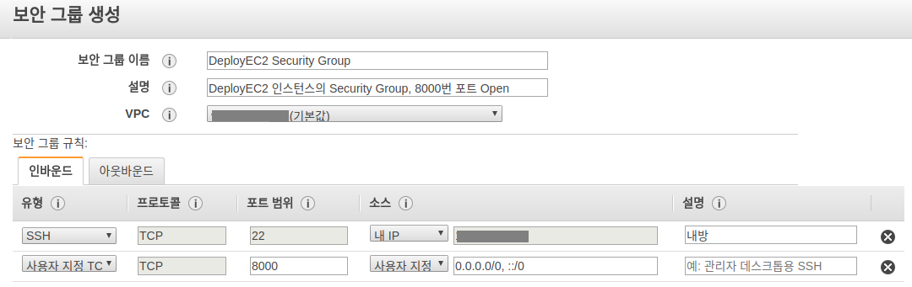

# Django 관련 설정


#### 장고 애플리케이션은 /srv Directory 사용

- 프로젝트를 서버의 /srv 폴더로 전송해야 하는데 이 폴더는 최초에는 root에게만 권한을 주고 있으므로 ubuntu 유저로 바꿔줘야 한다

```
sudo chown -R ubuntu:ubuntu /srv/


drwxr-xr-x   2 root   root   4.0K srv
>>>>
drwxr-xr-x   2 ubuntu ubuntu 4.0K srv
```

[관련설명]  
<http://www.thegeekstuff.com/2010/09/linux-file-system-structure/?utm_source=tuicool>

#### 프로젝트 Clone

```
git clone <자신의 프로젝트>
```

####로컬내에서 서버로 프로젝트 전송하기(SCP 사용)

```
scp -i <키페어 파일> <전송할 파일> <서버유저이름>@<AWS 퍼블릭 DNS>:/srv/<프로젝트 폴더 이름>

만약에 프로젝트 폴더 내 모든 파일을 보낸다면 -r 을 추가해준다(해당 폴더 내에서 입력할시)
scp -i <키페어 파일> -r  <전송할 파일> <서버유저이름>@ ...


전송과 삭제하는 명령어를 다음과 같이 정리한다

1.삭제
alias delete-ec2="ssh -i <키페어 파일> <서버유저이름>@<AWS 퍼블릭 DNS> rm -rf /srv/<프로젝트 폴더 이름>"
2. 전송
alias scp-ec2-ori="scp -i <키페어 파일> <전송할 파일> <서버유저이름>@<AWS 퍼블릭 DNS>:/srv/<프로젝트 폴더 이름>"
3. 삭제 후 다시 전송(=업데이트)
alias scp-ec2="delete-ec2 && scp-ec2-ori"
```

- 이것도 alias로 지정하면 좋다 `ex) scp-ec2`


#### pyenv 3.6.0 설치 및 virtualenv생성

```
1.먼저 /srv 폴더내에서 
pyenv install 3.6.0

2.그다음 프로젝트 폴더내에서 
pyenv virtualenv 3.6.0 deploy_ec2
pyenv local deploy_ec2
```

#### requirements설치

```
pip install -r requirements.txt
```

#### runserver 테스트

```
>>> python manage.py runserver --settings=config.settings.debug 0:8080

<AWS 퍼블릭 DNS>:8000 으로 접속한다
그러나 방화벽때문에 접속이 불가능 
```

####Security Group 생성



#### Security Group 연결

- 인스턴스 탭 > 인스턴스 클릭 > 네트워킹 > 보안 그룹 변경 > 새로만든 Security Group 선택

```
이제 접속이 된다

>>> python manage.py runserver --settings=config.settings.debug 0:8080

<퍼블릭 DNS>:8000
```

#### AWS Secutiriy Groups 8080 Port추가

Security Groups -> Inbound -> Edit -> Custom TCP Rule -> 8080

#### ALLOWED_HOSTS 설정

```
vi mysite/settings.py
ALLOWED_HOSTS = [
	'<ec2 domain name'>,
	또는
	'.amazonaws.com',
]
```


## uWSGI 관련 설정

#### 웹 서버 관리용 유저 생성

```
sudo adduser nginx
```

#### uWSGI설치

```
(virtualenv 환경 내부에서)
pip install uwsgi
```

#### uWSGI 정상 동작 확인

```
uwsgi --http :8080 --home (virtualenv경로) --chdir (django프로젝트 경로) -w (프로젝트명).wsgi
```

ex) pyenv virtualenv이름이 mysite-env, django프로젝트가 /srv/mysite/django_app, 프로젝트명이 mysite일 경우

```
uwsgi --http :8080 --home ~/.pyenv/versions/mysite-env --chdir /srv/mysite/django_app -w mysite.wsgi
```

실행 후 <ec2도메인>:8080으로 접속하여 요청을 잘 받는지 확인

#### uWSGI 사이트 파일 작성

```
sudo mkdir /etc/uwsgi
sudo mkdir /etc/uwsgi/sites
sudo vi /etc/uwsgi/sites/mysite.ini

[uwsgi]
chdir = /srv/mysite/django_app # Django application folder
module = mysite.wsgi:application # Django project name.wsgi
home = /home/ubuntu/.pyenv/versions/mysite # VirtualEnv location

uid = nginx
gid = nginx

socket = /tmp/mysite.sock
chmod-socket = 666
chown-socket = nginx:nginx

enable-threads = true
master = true
pidfile = /tmp/mysite.pid
```

#### uWSGI site파일로 정상 동작 확인

```
uwsgi --http :8080 -i /etc/uwsgi/sites/mysite.ini
```

sudo로 root권한으로 실행

```
sudo /home/ubuntu/.pyenv/versions/mysite/bin/uwsgi --http :8080 -i /etc/uwsgi/sites/mysite.ini
```

#### uWSGI 서비스 설정파일 작성

```
sudo vi /etc/systemd/system/uwsgi.service

[Unit]
Description=uWSGI Emperor service
After=syslog.target

[Service]
ExecPre=/bin/sh -c 'mkdir -p /run/uwsgi; chown nginx:nginx /run/uwsgi'
ExecStart=/home/ubuntu/.pyenv/versions/mysite/bin/uwsgi --uid nginx --gid nginx --master --emperor /etc/uwsgi/sites

Restart=always
KillSignal=SIGQUIT
Type=notify
StandardError=syslog
NotifyAccess=all

[Install]
WantedBy=multi-user.target
```

#### 리부팅 시 자동으로 실행되도록 설정

```
sudo systemctl enable uwsgi
```


## Nginx 관련 설정

#### Nginx 안정화 최신버전 사전세팅 및 설치

```
sudo apt-get install software-properties-common python-software-properties
sudo add-apt-repository ppa:nginx/stable
sudo apt-get update
sudo apt-get install nginx
nginx -v
```

#### Nginx 동작 User 변경

```
sudo vi /etc/nginx/nginx.conf

user nginx;
```

#### Nginx 가상서버 설정 파일 작성

```
sudo vi /etc/nginx/sites-available/mysite

server {
    listen 80;
    server_name localhost;
    charset utf-8;
    client_max_body_size 128M;


    location / {
        uwsgi_pass    unix:///tmp/mysite.sock;
        include       uwsgi_params;
    }
}
```

#### 설정파일 심볼릭 링크 생성

```
sudo ln -s /etc/nginx/sites-available/mysite /etc/nginx/sites-enabled/mysite
```

#### sites-enabled의 default파일 삭제

```
sudo rm /etc/nginx/sites-enabled/default
```

> nginx.conf파일에 어떤 폴더에 있는 설정을 가져와서 실행할 지 적혀있음


#### uWSGI, Nginx재시작

```
sudo systemctl restart uwsgi nginx
```

-

### 오류 발생 시

#### systemctl restart시 오류 발생 시

```
(오류 발생한 서비스에 따라 아래 명령어 실행)
sudo systemctl status uwsgi.service
sudo systemctl status nginx.service
```

#### 502 Bad Gateway

**Nginx log파일 확인**  
```
cat /var/log/nginx/error.log
```

#### Nginx log파일에서 sock파일 접근 불가시

**socket파일 권한 소유자 확인**

```
cd /tmp
ls -al
-rw-r--r--  1 nginx  nginx     6 Nov  8 06:58 mysite.pid
srw-rw-rw-  1 nginx  nginx     0 Nov  8 06:58 mysite.sock

nginx가 소유자가 아닐 경우, 
sudo rm mysite.pid mysite.sock으로 삭제 후 서비스 재시작
```

## 서버 설정

### Media

> 본인의 media폴더 위치를 확인

`sudo vi /etc/nginx/sites-available/app`

```
location /media/ {
	alias /srv/app/media/;
}
```

**이미지 업로드시 Permission Denied발생 할 경우**  
`sudo chmod 777 media`로 `media`폴더의 권한을 변경, `media`폴더 하위 폴더 모두 삭제 후 다시 실행


### Static

> 본인의 static_root폴더 위치를 확인

`sudo vi /etc/nginx/sites-available/app`

```
location /static/ {
	alias /srv/app/static_root/;
}
```

### 데이터베이스

> macOS에서는 `sudo -u postgres` 입력 불필요

**유저생성**  
`sudo -u postgres createuser -s -P <username>`

**유저삭제**  
`sudo -u postgres dropuser <username>`

**삭제**  
`sudo -u postgres dropdb <db name>`

**생성**  
`sudo -u postgres createdb <db name> owner=<owner name>`

-

#### AWS Secutiriy Groups 80 Port추가

Security Groups -> Inbound -> Edit -> HTTP


## Cloudflare

#### ALLOWED_HOSTS 추가


## SSL

> [Nginx에 SSL적용](https://haandol.wordpress.com/2014/03/12/nginx-ssl-%EC%A0%81%EC%9A%A9%ED%95%98%EA%B8%B0startssl-com%EC%9D%84-%EC%9D%B4%EC%9A%A9%ED%95%98%EC%97%AC/)  
> [Cloudflare에 Custom SSL적용](https://support.cloudflare.com/hc/en-us/articles/200170466-How-do-I-upload-a-custom-SSL-certificate-Business-or-Enterprise-only-)


## S3 연결

### boto3를 이용해서 S3 Bucket생성

`boto3`

```python
pip install boto3
```

```
>>> import boto3
>>> session = boto3.Session(profile_name='fc-4th')
>>> client = session.client('s3')
>>> client.create_bucket(Bucket='fc-4th-test', CreateBucketConfiguration={'LocationConstraint': 'ap-northeast-2'})
{'Location': 'http://fc-4th-test.s3.amazonaws.com/', 'ResponseMetadata': {'RequestId': '0B679A5EBF1FCF19', 'HostId': 'qLvVYj0n74HZKnA46m+ILCabPs71dt0GEqNFllrRguaBSbvQ2MpQ4aWhOT/PjHFzVo8nE1/H4cw=', 'HTTPStatusCode': 200, 'RetryAttempts': 0, 'HTTPHeaders': {'content-length': '0', 'location': 'http://fc-4th-test.s3.amazonaws.com/', 'date': 'Thu, 09 Mar 2017 01:41:17 GMT', 'x-amz-id-2': 'qLvVYj0n74HZKnA46m+ILCabPs71dt0GEqNFllrRguaBSbvQ2MpQ4aWhOT/PjHFzVo8nE1/H4cw=', 'x-amz-request-id': '0B679A5EBF1FCF19', 'server': 'AmazonS3'}}}
>>> 
```
