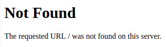
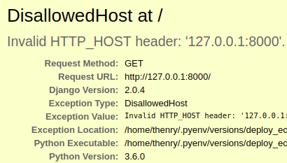

# Django 관련 설정


#### 장고 애플리케이션은 /srv Directory 사용

- 프로젝트를 서버의 /srv 폴더로 전송해야 하는데 이 폴더는 최초에는 root에게만 권한을 주고 있으므로 ubuntu 유저로 바꿔줘야 한다

```
sudo chown -R ubuntu:ubuntu /srv/


drwxr-xr-x   2 root   root   4.0K srv
>>>>
drwxr-xr-x   2 ubuntu ubuntu 4.0K srv
```

[관련설명]  
<http://www.thegeekstuff.com/2010/09/linux-file-system-structure/?utm_source=tuicool>

#### 프로젝트 Clone

```
git clone <자신의 프로젝트>
```

#### 로컬내에서 서버로 프로젝트 전송하기(SCP 사용)

```
scp -i <키페어 파일> <전송할 파일> <서버유저이름>@<AWS 퍼블릭 DNS>:/srv/<프로젝트 폴더 이름>

만약에 프로젝트 폴더 내 모든 파일을 보낸다면 -r 을 추가해준다(해당 폴더 내에서 입력할시)
scp -i <키페어 파일> -r  <전송할 파일> <서버유저이름>@ ...


전송과 삭제하는 명령어를 다음과 같이 정리한다

1.삭제
alias delete-ec2="ssh -i <키페어 파일> <서버유저이름>@<AWS 퍼블릭 DNS> rm -rf /srv/<프로젝트 폴더 이름>"
2. 전송
alias scp-ec2-ori="scp -i <키페어 파일> <전송할 파일> <서버유저이름>@<AWS 퍼블릭 DNS>:/srv/<프로젝트 폴더 이름>"
3. 삭제 후 다시 전송(=업데이트)
alias scp-ec2="delete-ec2 && scp-ec2-ori"
```

- 이것도 alias로 지정하면 좋다 `ex) scp-ec2`


#### pyenv 3.6.0 설치 및 virtualenv생성

```
1.먼저 /srv 폴더내에서 
pyenv install 3.6.0

2.그다음 프로젝트 폴더내에서 
pyenv virtualenv 3.6.0 deploy_ec2
pyenv local deploy_ec2
```

#### requirements설치

```
pip install -r requirements.txt
```

#### runserver 테스트

```
>>> python manage.py runserver --settings=config.settings.debug 0:8080

<AWS 퍼블릭 DNS>:8000 으로 접속한다
그러나 방화벽때문에 접속이 불가능 
```

#### Security Group 생성


#### Security Group 연결

- 인스턴스 탭 > 인스턴스 클릭 > 네트워킹 > 보안 그룹 변경 > 새로만든 Security Group 선택

```
이제 접속이 된다

>>> python manage.py runserver --settings=config.settings.debug 0:8080

<퍼블릭 DNS>:8000
```

#### AWS Secutiriy Groups 8080 Port추가

Security Groups -> Inbound -> Edit -> Custom TCP Rule -> 8080

#### ALLOWED_HOSTS 설정

```
vi mysite/settings.py
ALLOWED_HOSTS = [
	'<ec2 domain name'>,
	또는
	'.amazonaws.com',
]
```

#### debug.py deploy.py

- 로컬 프로젝트 내 settings 패지키 내부에 debug.py 와 deploy.py 작성한다

```
(debug.py)

from .base import *

config_secret_debug = json.loads(open(CONFIG_SECRET_DEBUG_FILE).read())
DEBUG = True
ALLOWED_HOSTS = config_secret_debug['django']['allowed_hosts']

----------------------------------------------
(deploy.py)

from .base import *

config_secret_deploy = json.loads(open(CONFIG_SECRET_DEPLOY_FILE).read())
DEBUG = False # 배포모드 이기 때문에 False이다
ALLOWED_HOSTS = config_secret_deploy['django']['allowed_hosts']
```
- EC2 서버로 추가내용 업데이트한다

#### Runserver

```
로컬과 서버내에서 둘다

>>> ./manage.py runserver --settings=config.settings.deploy 0:8000
```

- 아직 url이 없기때문에 아래와 같이 표시된다



- debug로 돌리면 이런 메시지가 표시된다


#### makemigration, migrate

```
>>> ./manage.py makemigrations --settings=config.settings.debug
>>> ./manage.py migrate --settings=config.settings.debug

뒤에 붙는게 길기때문에 아래 명령어로 줄여서 쓸수있다
>>>export DJANGO_SETTINGS_MODULE=config.settings.debug

이제 뒷에 붙는 부분 없이 명령어를 사용가능하다
>>> ./manage.py makemigration
>>> ./manage.py migrate

해당 터미널에서만 적용되고 새로운 터미널에서는 다시 적용해줘야 한다
```

#### allowed hosts

- allowed_hosts를 바꿔준다

```
(settings_debug.json)

"allowed_hosts": [
	"localhost"
]
```

- localhost:8000로 접속했을때


- 127.0.0.1:8000로 접속했을때



- deploy도 바꿔준다

```
(settings_deploy.json)

"allowed_hosts": [
	"퍼블릭 DNS"
]
```

